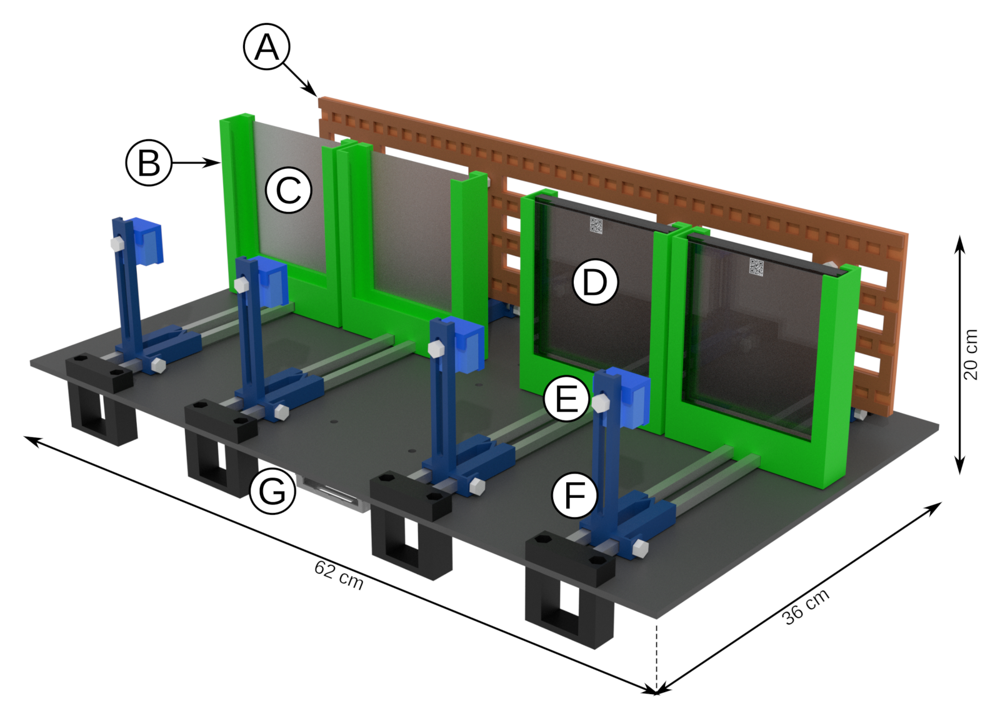
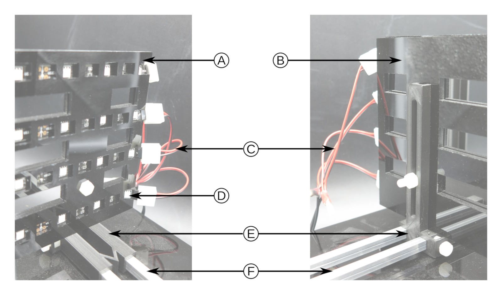
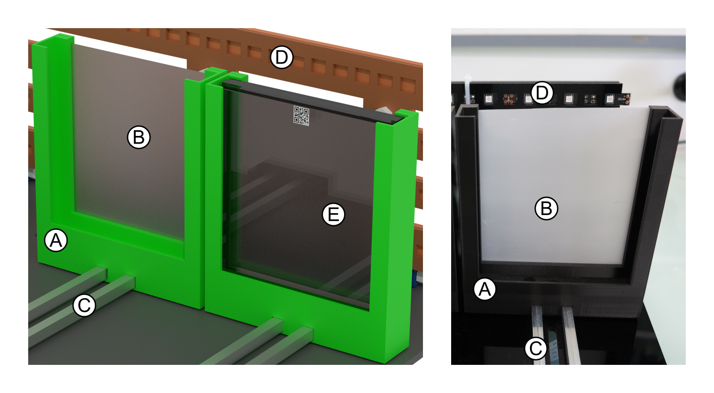
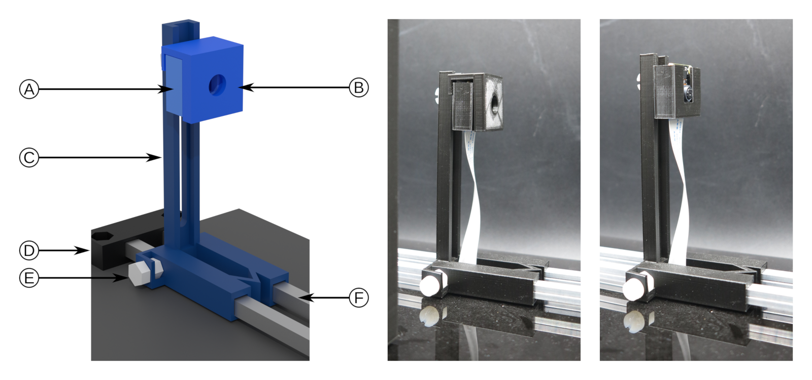
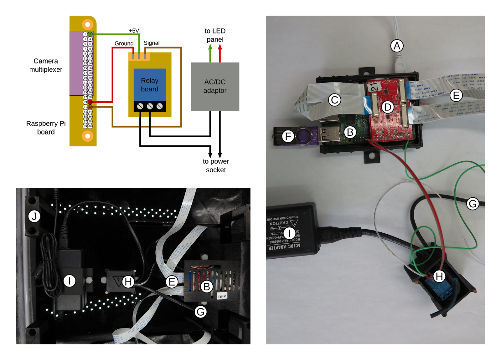

# ChronoRoot: High-throughput phenotyping by deep learning reveals novel temporal parameters of plant root system architecture

Nicolás Gaggion¹, Federico Ariel², Vladimir Daric³, Éric Lambert³, Simon Legendre³, Thomas Roulé³, Alejandra Camoirano², Diego Milone¹, Martin Crespi³, Thomas Blein³, Enzo Ferrante¹

¹ Research Institute for Signals, Systems and Computational Intelligence (sinc(i)), FICH-UNL, CONICET, Ciudad Universitaria UNL, Santa Fe, Argentina.\
² Instituto de Agrobiotecnología del Litoral (IAL), CONICET, FBCB, Universidad Nacional del Litoral, Colectora Ruta Nacional 168 km 0, Santa Fe, Argentina.\
³ Institute of Plant Sciences Paris-Saclay (IPS2), CNRS, INRA, University Paris-Saclay and University of Paris Bâtiment 630, 91192 Gif sur Yvette, France.

# ChronoRoot Module Hardware Design

The hardware (3D print and laser cut) of the ChronoRoot module designed
for image-based plant phenotyping.

## ChronoRoot module description

The ChronoRoot device is an affordable and modular imaging system based on 3D-printed
and laser cut pieces and off-the-shelf electronics. Each module consists of a
Raspberry Pi (v3)-embedded computer controlling four fixed-zoom and fixed-focus cameras
(RaspiCam v2), and an array of infrared (IR) LED back-light. In between each camera
and the corresponding IR array, there is a vertical 12 x 12 cm plate for seedling
growth, allowing automatic image acquisition repeatedly along the experiment without any
modification or movement of the imaging setup. The four-plate module is small
(62 x 36 x 20 cm) and can be placed in any growth chamber. The different parts of
the imaging setup (back-light, plate support and camera) can be positioned along
a horizontal double-rail to control the field of view of the camera and accurate lightning.
In addition, the camera can be moved vertically. ChronoRoot allows image
acquisition at a high temporal resolution (a set of pictures every minute). The
use of an IR back-light (850 nm) and optional long pass IR filters (> 830 nm)
allow acquiring images of the same quality independently from the light conditions
required for the experiment, during day and night.

## Description of the module

In this repository, we include the hardware specification and the 3D printing
and laser cutting files needed to build a module. These notes and files are
provided as open-hardware specifications (CERN Open Hardware Licence version 2),
to encourage other scientists to 3D print and mount the device in their own
laboratories.

The module consist of a Raspberry Pi 3 model B with an additional camera multiplexer
module (IVPort V2 Raspberry Pi Camera Module V2 Multiplexer, Ivmech Mekatronik
& İnovasyon Ltd.) and allows to connect four cameras. It is boxed in a cage
fixed under the main board.

### Low-cost device for automatic image acquisition of plant plates. 3D rendering of a ChronoRoot module.

(A) mobile and controlled infrared (IR) backlight (850 nm), (B) mobile plate
support, (C) diffusing filter, (D) 12 cm x 12 cm square plate with QR code on
the top, (E) Camera case equipped with an IR long pass filter (> 830 nm), (F)
mobile camera support, (G) Raspberry Pi computer controlling the module (IR
backlight and camera).  The NIR illumination was build with four rows of LED
flexible tape (tri-chip SMD5050-150-IR 850 nm, Huake LTD, China) fixed in
a sandwich between two acrylic plates (580 mm x 140 mm x 3 mm) laser cuts to
allow air flow and prevent the LED strip from ungluing. The four strips of LED
were connected in parallel to a 12V AC/DC adaptor fixed under the module. The
power supply cable of the adaptor is under the control of relay (Single Relay
Board #27115, Parallax Inc), in a box fixed near the adaptor. It allows the
control of the NIR illumination by the computer. The LED array is maintained
vertically by L-shaped supports able to move along the aluminum horizontal axes
as four individual panels in the module, corresponding to the respective plant
plates.

### LED near-infrared panel

Front view (left) and back view (right). The LED strips (D) are squeezed in
between two acrylic panels (A and B) to prevent them from unsticking from the
back panel. The strips are linked in parallel to the AC/DC adaptor through strip
connector (C). The full LED panel is kept in vertical position via an L-shaped
support (E) able to move along the double aluminum axis (F). Acrylic screws and
nuts are used to maintain the LED panel on the L-shape support and fixed the
horizontal position on the horizontal axis. U-shaped plate holders were designed
to hold 12.5 cm x 12.5 cm square petri dishes used to grow the plants. The plate
holder carries a diffusion filter (Cinegel R3000 Tough Rolux, Rosco Laboratories
Inc.) at the back of the plate to allow homogeneous backlight illumination of
the plates by the NIR LED array.  The four plate holders can be moved
independently along their respective horizontal axis.

### Plate support

Annotated 3D rendering (left) and picture (right) of the plate support. The
U-shaped plate support (A) carries a diffusion filter at the back (B) allowing
an homogeneous near-infrared illumination. Each support moves horizontally on
the double axis (C). A classical 12.5 cm x 12.5 cm square plate fit into the
plate support (E).  Each camera is a regular Raspberry Pi NoIR V2 module (Sony
IMX219 8-megapixel sensor) which is able to capture NIR wavelengths in addition
to the classical visible spectrum. It is positioned in a box that can be moved
vertically on an L-shaped support which can be shifted along the horizontal
axis. The focus of the camera is adjusted manually before the start of the
experiment by turning the objective lens using the provided crown. To be able to
record pictures exclusively from the NIR spectrum, an IR long pass filter (12.5
mm diameter, RG830 Schott AG) can be positioned in front of the camera to
exclude light below 830 nm and provide consistent images independently of the
lightning of the growth chamber.

### The camera setup

(Left) annotated 3D rendering; (middle) camera on a module carrying a filter;
(right) camera on a module without the filter. A Raspberry Pi NoIR V2 module is
enclosed in a 3D printed box (A) that could carry an optional filter (B). The
box can be moved vertically on an L-shaped support (C) which itself is able to
move along a double aluminum axis (F); The position of the L-shape support and
of the camera box are secured by acrylic screw and nut (E for L-shaped support).
The double aluminum axis is attached to the main board by a 3D printed part (D).

### Electronic connection of a module.

Schematic electric connection between the Raspberry Pi GPIO, the camera
multiplexer, the relay board and AC/DC adaptor (up left). Real view of the
connection with different part boxes open (right). The Raspberry Pi (B) is
connected to a USB power adaptor (A). The camera multiplexer module (D) is
plugged on the Raspberry Pi GPIO port and connected to the Raspberry Pi camera
by a strip (C). Each camera is connected to the multiplexer by a strip (E). The
pictures are saved on a USB stick (F) or a USB hard drive directly connected to
the Raspberry Pi. A relay board (H) is connected to the Raspberry Pi GPIO and
controls the main power (G) of the AC/Dc adaptor powering the LED strip. The
final organization of the controlling part under the module main board raised by
foots (J).

# ChronoRoot Module Controler

Software for image aquisition on the module available on the [ChronoRoot Module Controler repository](https://github.com/ThomasBlein/ChronoRootControl)

# Image analysis

Software for image analysis available on the [ChronoRoot repository](https://github.com/ngaggion/ChronoRoot/)
